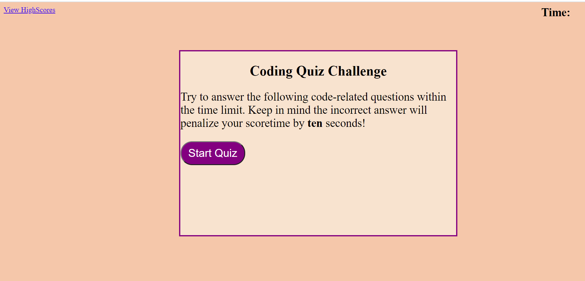
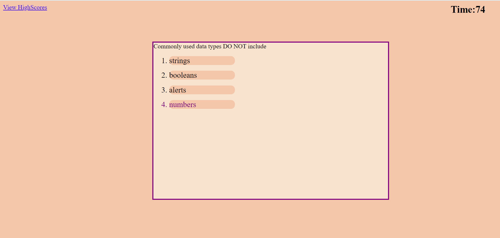

# Code-Quiz

### Purpose
A coding boot camp student wanted a timed quiz on JavaScript fudamentals that would save the high score. My project consists of five questions and choices and comfirms if an answer is correct or not. The student will have 80 seconds to complete the quiz and has a penalty of 10 secs for each incorrect answer. If the student is unable to finish the quiz within the time the page will redirected to the last page. The quiz will save your highscore and reveal how well the student did at the end. 

### Screenshots

### Built With
*Html
*CSS
*JavaScript

### Website
http://aclarke0307.github.io/Code-Quiz/

### Contribution
aclarke0307
